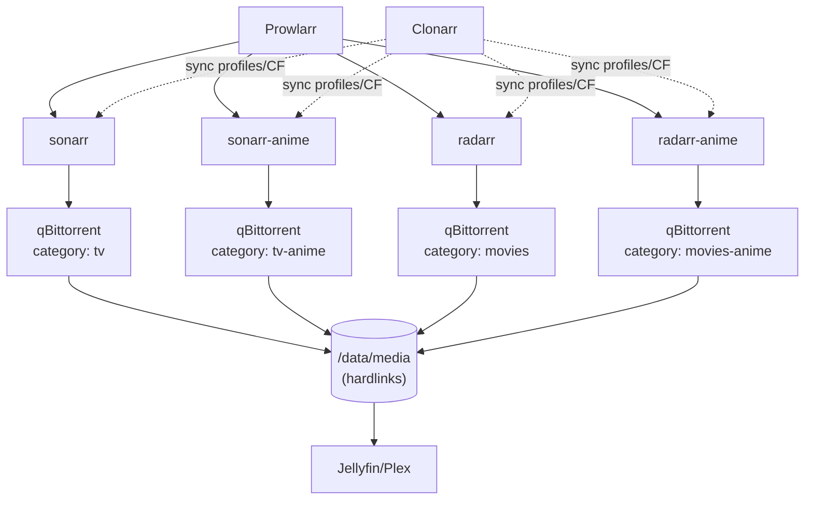

# Arr Stack — документация

Медиастек для автоматической загрузки и раздачи контента. Следуем
[TRaSH Guides](https://trash-guides.info/), синхронизация профилей и кастомных
форматов — через [Clonarr](https://github.com/ProphetSe7en/clonarr).

## Архитектура

Контент разделён на 4 инстанса (по рекомендации TRaSH для аниме — отдельные
инстансы, а не профили в одном). Причины разделения аниме:

- Quality Definitions (лимиты размера файлов) — настройка per-instance, у аниме
  свои гайдовые значения;
- Naming scheme для аниме (absolute episode numbers) — глобальная настройка
  инстанса, не конфликтует с обычным неймингом;
- ~30 аниме-CF (BD/Web тиры, v0–v4, Dual Audio, Raws...) не засоряют профили
  обычного контента;
- отдельные root folders и категории в download-клиенте → чистые hardlinks и
  отдельные библиотеки в медиасервере.



## Инстансы

| Сервис          | Контент              | Root folder                  | Категория qbit | TRaSH-шаблон          |
|-----------------|----------------------|------------------------------|----------------|-----------------------|
| `sonarr`        | Обычные сериалы      | `/data/media/tv/`            | `tv`           | WEB-1080p / HD Bluray+WEB |
| `sonarr-anime`  | Аниме-сериалы        | `/data/media/anime/series/`  | `tv-anime`     | `[Anime] Remux-1080p` |
| `radarr`        | Обычные фильмы       | `/data/media/movies/`        | `movies`       | Remux+WEB-1080p       |
| `radarr-anime`  | Полнометражное аниме | `/data/media/anime/movies/`  | `movies-anime` | `[Anime] Remux-1080p` |

Вспомогательные сервисы:

| Сервис      | Назначение                                              |
|-------------|---------------------------------------------------------|
| `prowlarr`  | Индексаторы, синхронизация во все 4 инстанса            |
| `clonarr`   | Синк TRaSH-профилей, CF, Quality Definitions, нейминга  |
| `qbittorrent` | Download-клиент (через VPN/gluetun)                   |
| `bazarr` (+ `-anime`) | Субтитры (опционально)                          |

## Файловая структура

Общий share `/data` — единая точка монтирования во все контейнеры, чтобы
работали hardlinks и atomic moves (см. TRaSH «Hardlinks and Atomic Moves»).

```
/data
├── torrents/                 # download-клиент
│   ├── tv/
│   ├── tv-anime/
│   ├── movies/
│   └── movies-anime/
└── media/                    # библиотека (hardlinks из torrents)
    ├── tv/
    ├── movies/
    └── anime/
        ├── series/
        └── movies/
```

Категории в qBittorrent соответствуют root folders: Sonarr качает в
`torrents/tv`, импортирует (hardlink) в `media/tv`, раздача продолжается из
торрент-папки без дублирования места.

## Prowlarr

Все 4 инстанса добавлены как Apps (Settings → Apps).

- Обычные индексаторы → синк во все инстансы (или по необходимости).
- Аниме-индексаторы (Nyaa и т.п.) → тег `anime`, синк **только** в
  `sonarr-anime` и `radarr-anime` (у тех Apps выставлен тег `anime`).
  Иначе Nyaa-результаты спамят поиск обычных инстансов.
- На аниме-индексаторах включена категория `Anime English-Translated`, если
  не нужны равы без сабов (Settings → Indexers → опции индексатора).

## Clonarr

Управляет конфигурацией всех 4 инстансов (Settings → Multiple instances,
переключение сверху). Что синкается в каждый инстанс:

1. **Quality Profiles** — Profiles → TRaSH Profiles → Use profile:
   - `sonarr` / `radarr`: стандартные профили гайда (WEB-1080p или
     Remux + WEB 1080p — по вкусу);
   - `sonarr-anime` / `radarr-anime`: `[Anime] Remux-1080p` со скорингом
     из аниме-гайда (BD/Web тиры SeaDex, v0–v4, `Anime Raws`/`Dubs Only`/
     `AV1` в -10000). Опционально подняты `Anime Dual Audio` / `Uncensored` /
     `10bit`.
2. **Quality Definitions** (Media Management → Quality Definitions):
   - обычные инстансы — стандартные Sonarr/Radarr Quality Definitions;
   - аниме-инстансы — **Sonarr Quality Definitions — Anime** (для Radarr-anime —
     стандартные Radarr, отдельного аниме-варианта у Radarr нет).
3. **File Naming** — гайдовые схемы (см. ниже).

Auto-sync: режим «Just notify me» — уведомление + бейдж при обновлении гайдов
или при ручном drift в Arr, применение вручную после ревью dry-run.

Перед каждым применением — **Dry Run**, периодически — backup профилей через
Tools → Maintenance.

## Нейминг

### Обычный контент (sonarr / radarr)

Стандартная гайдовая схема TRaSH (Plex/Jellyfin-вариант), применяется из
Clonarr → Media Management → File Naming.

### Аниме (sonarr-anime)

```
Series Folder:  {Series CleanTitleWithoutYear} {(Series Year)}
Season Folder:  Season {season:00}
Episode:        {Series CleanTitleWithoutYear} {(Series Year)} - S{season:00}E{episode:00} - {absolute:000} - {Episode CleanTitle:90} {[Custom Formats]}{[Quality Full]}{[Mediainfo AudioCodec}{ Mediainfo AudioChannels]}{MediaInfo AudioLanguages}{[MediaInfo VideoDynamicRangeType]}[{Mediainfo VideoCodec }{MediaInfo VideoBitDepth}bit]{-Release Group}
Multi-Episode:  Prefixed Range
```

При добавлении сериала в `sonarr-anime` обязательно **Series Type = Anime**.

### radarr-anime

Стандартная гайдовая схема Radarr (отдельного аниме-нейминга для Radarr нет).

## Профили качества — ключевые настройки

### sonarr / radarr (обычный контент)

- Upgrade Until: верх профиля (Bluray-1080p / Remux-1080p);
- Upgrade Until Custom Format Score: ~10000 (апгрейд до лучшего CF-скора);
- CF-скоринг по гайду (Streaming Services, HDR/DV, x265/HDR — по железу).

### sonarr-anime / radarr-anime

- Мерж quality-групп: `Bluray-1080p Remux` + `Bluray-1080p` в одну группу;
  `HDTV-1080p` в группу с `WEBDL-1080p`/`WEBRip-1080p`; аналогично для 720p
  (иначе аниме-скоринг работает некорректно);
- Upgrade Until: `Bluray-1080p` (Sonarr) / `Remux-1080p` (Radarr);
- Upgrade Until CF Score: 10000;
- radarr-anime: Language = Original;
- Скоринг: Anime BD Tier 01–08 (1400→700), Remux Tier 01–03 (975/950/925),
  Anime Web Tier 01–06 (600→100), стриминги CR/DSNP/NF/AMZN...,
  штрафы: `Anime Raws`, `Anime LQ Groups`, `Dubs Only`, `VOSTFR`, `AV1` = -10000;
  версии v0 = -51, v1–v4 = 1–4.

## Workflow добавления контента

| Что                | Куда добавлять   | Примечание                          |
|--------------------|------------------|-------------------------------------|
| Обычный сериал     | `sonarr`         | Series Type = Standard              |
| Аниме-сериал       | `sonarr-anime`   | Series Type = **Anime**             |
| Обычный фильм      | `radarr`         |                                     |
| Аниме-фильм        | `radarr-anime`   |                                     |

Пограничные случаи (аниме-фильм, который есть в TVDB как спешл, и наоборот) —
ручное решение, обычно по источнику релизов: если контент живёт на Nyaa — в
аниме-инстанс.

## Медиасервер

Отдельные библиотеки: `TV`, `Movies`, `Anime Series`, `Anime Movies` →
соответствующие root folders из `/data/media/`. Для аниме-библиотек —
скрапер/агент с поддержкой AniDB/absolute numbering (в Jellyfin — AniDB
плагин, в Plex — HAMA/ASS или «Plex Series Scanner» с осторожностью).

## Обслуживание

- **Обновление гайдов**: Clonarr обновляет клон TRaSH-репо каждые 24 ч,
  присылает уведомление о доступных обновлениях → ревью dry-run → apply.
- **Бэкапы**: `/config` Clonarr (профили, sync history), конфиги всех Arr
  (встроенные бэкапы Sonarr/Radarr + snapshot appdata).
- **Очистка**: Tools → Maintenance в Clonarr (orphaned scores, unused
  profiles), периодическая проверка неимпортированного в Activity каждого
  инстанса.

## Ссылки

- [TRaSH: Sonarr Anime Guide](https://trash-guides.info/Sonarr/sonarr-setup-quality-profiles-anime/)
- [TRaSH: Radarr Anime Guide](https://trash-guides.info/Radarr/radarr-setup-quality-profiles-anime/)
- [TRaSH: Hardlinks and Atomic Moves](https://trash-guides.info/Hardlinks/Hardlinks-and-Atomic-Moves/)
- [Clonarr](https://github.com/ProphetSe7en/clonarr)
